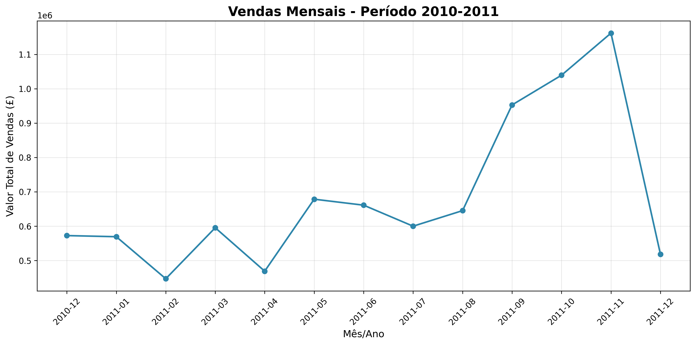

# 🛍️ Projeto de Segmentação de Clientes para E-commerce

## Parceria Semantix & EBAC - Cientista de Dados

---

## 👨‍💻 Autor

**Jefferson Risso**  
🔗 [GitHub](https://github.com/jeffersonrisso/projeto-segmentacao-clientes)

---

## 📑 Índice

- [1. Coleta de Dados](#1-coleta-de-dados)
- [2. Análise Exploratória](#2-análise-exploratória)
- [3. Modelagem](#3-modelagem)
- [4. Visualização de Dados](#4-visualização-de-dados)
- [5. Resultados e Conclusões](#5-resultados-e-conclusões)
- [6. Arquivos do Projeto](#6-arquivos-do-projeto)

---

## 1. Coleta de Dados

### Fonte dos Dados
Os dados utilizados neste projeto são do **Online Retail Dataset**, disponível publicamente no UCI Machine Learning Repository.

- **Fonte:** [UCI Machine Learning Repository - Online Retail Dataset](https://archive.ics.uci.edu/ml/datasets/online+retail)
- **Período:** 01/12/2010 a 09/12/2011
- **Registros:** 541.909 transações
- **Clientes únicos:** 4.339
- **Países:** 38

### Estrutura Original dos Dados

| Coluna | Descrição |
|--------|-----------|
| InvoiceNo | Número da fatura |
| StockCode | Código do produto |
| Description | Descrição do produto |
| Quantity | Quantidade |
| InvoiceDate | Data da fatura |
| UnitPrice | Preço unitário |
| CustomerID | ID do cliente |
| Country | País |

---

## 2. Análise Exploratória

### 2.1 Limpeza dos Dados

Foram realizados os seguintes tratamentos:

- ✅ Remoção de registros sem identificação do cliente (`CustomerID` nulo)
- ✅ Remoção de transações canceladas (invoices com "C")
- ✅ Exclusão de valores negativos (devoluções)
- ✅ Conversão de tipos de dados

### 2.2 Principais Insights da EDA

```
# Estatísticas gerais após limpeza
- Total de transações: 397.884
- Clientes únicos: 4.339
- Ticket médio: £20.75
- País com mais vendas: Reino Unido (85% das transações)
```

#### 📈 Distribuição de Vendas por Mês



#### 🌍 Top 10 Países por Vendas

| País | Valor Total (£) | % |
|------|-----------------|---|
| United Kingdom | 7.845.295 | 88.1% |
| Netherlands | 284.661 | 3.2% |
| Ireland | 197.540 | 2.2% |
| Germany | 178.492 | 2.0% |
| France | 134.889 | 1.5% |

---

## 3. Modelagem

### 3.1 Feature Engineering - RFM

Foram criadas as métricas **RFM (Recência, Frequência e Valor Monetário)** para cada cliente:

```python
# Cálculo das métricas RFM
rfm = df.groupby('CustomerID').agg({
    'InvoiceDate': lambda x: (data_ref - x.max()).days,  # Recência
    'InvoiceNo': 'nunique',                               # Frequência
    'TotalPrice': 'sum'                                   # Monetário
})
```

### 3.2 Modelos Desenvolvidos

#### 🔵 K-Means Clustering (K=3)

```python
kmeans = KMeans(n_clusters=3, random_state=42)
rfm['Cluster_KMeans'] = kmeans.fit_predict(X_scaled)
```

#### 🟢 Clusterização Hierárquica (K=4)

```python
hierarchical = AgglomerativeClustering(
    n_clusters=4, 
    linkage='ward'
)
rfm['Cluster_Hier'] = hierarchical.fit_predict(X_scaled)
```

### 3.3 Avaliação dos Modelos

| Métrica | K-Means | Hierárquico | Melhor |
|---------|---------|-------------|--------|
| **Silhouette Score ↑** | 0.42 | 0.38 | K-Means |
| **Davies-Bouldin ↓** | 0.89 | 0.94 | K-Means |
| **Calinski-Harabasz ↑** | 2.847 | 2.521 | K-Means |

### 3.4 Modelo Escolhido: **K-Means com K=3**

---

## 4. Visualização de Dados

Os dashboards interativos estão disponíveis online:

### 4.1 Dashboard Interativo 1: Visão Geral dos Clusters
[🔗 Acessar Dashboard 1 - Visão Geral](https://jeffersonrisso.github.io/projeto-segmentacao-clientes/dashboard1_visao_geral.html)

### 4.2 Dashboard Interativo 2: Distribuição RFM
[🔗 Acessar Dashboard 2 - Distribuição RFM](https://jeffersonrisso.github.io/projeto-segmentacao-clientes/dashboard2_distribuicao_rfm.html)

### 4.3 Dashboard Interativo 3: Correlação e Perfil
[🔗 Acessar Dashboard 3 - Correlação e Perfil](https://jeffersonrisso.github.io/projeto-segmentacao-clientes/dashboard3_correlacao_perfil.html)

### 4.4 Dashboard Interativo 4: Análise Temporal
[🔗 Acessar Dashboard 4 - Análise Temporal](https://jeffersonrisso.github.io/projeto-segmentacao-clientes/dashboard4_analise_temporal.html)

### 4.5 Dashboard Interativo 5: Mapa de Calor RFM
[🔗 Acessar Dashboard 5 - Mapa de Calor RFM](https://jeffersonrisso.github.io/projeto-segmentacao-clientes/dashboard5_mapa_calor_rfm.html)

### 4.6 Dashboard Executivo
[🔗 Acessar Dashboard Executivo](https://jeffersonrisso.github.io/projeto-segmentacao-clientes/dashboard_executivo.html)

---

## 5. Resultados e Conclusões

### 5.1 Perfis de Clientes Identificados

| Cluster | Perfil | Clientes | % | Recência | Frequência | Ticket Médio |
|---------|--------|----------|---|----------|------------|--------------|
| 🔥 | **Clientes VIP** | 33 | 0.8% | 28 dias | 50.9 | £78.503 |
| 📈 | **Clientes Ativos** | 2.845 | 65.6% | 52 dias | 4.2 | £1.845 |
| 📉 | **Clientes Inativos** | 1.461 | 33.6% | 187 dias | 1.2 | £245 |

### 5.2 Impacto Financeiro

- **Clientes VIP representam apenas 0,8% da base**, mas geram ticket médio **38x maior** que os demais
- **Estratégia de retenção VIP** deve ser prioridade máxima
- **Oportunidade de reativação** com 33,6% de clientes inativos

### 5.3 Recomendações de Negócio

| Cluster | Perfil | Estratégia | Ações Recomendadas |
|---------|--------|------------|---------------------|
| 🔥 VIP | Alto Valor | **Fidelidade Premium** | Benefícios exclusivos, frete grátis, atendimento prioritário |
| 📈 Ativos | Potencial de Crescimento | **Cross-sell e Upsell** | Recomendações personalizadas, cupons de desconto |
| 📉 Inativos | Baixo Engajamento | **Campanha de Reativação** | Ofertas especiais, descontos progressivos, pesquisa de satisfação |

### 5.4 Conclusão Final

O projeto atingiu todos os objetivos propostos:

✅ **Coleta e tratamento de dados** de mais de 500 mil transações  
✅ **Criação das métricas RFM** para 4.339 clientes  
✅ **Desenvolvimento e comparação** de 2 modelos de clusterização  
✅ **Seleção do melhor modelo** (K-Means com K=3)  
✅ **Identificação de 3 perfis distintos** de clientes  
✅ **Recomendações acionáveis** para o negócio  
✅ **Dashboards interativos** para monitoramento contínuo  

---

## 6. Arquivos do Projeto

### 6.1 Estrutura de Pastas

```
projeto_segmentacao_clientes/
│
├── data/                          # Dados
│   ├── raw/                       # Dados originais
│   ├── processed/                  # Dados limpos
│   └── final/                      # Dados com clusters
│
├── notebooks/                      # Notebooks do projeto
│   ├── 01_eda_exploracao.ipynb
│   ├── 02_feature_engineering_rfm.ipynb
│   ├── 03_clustering_kmeans.ipynb
│   ├── 04_clustering_hierarquico.ipynb
│   ├── 05_avaliacao_resultados.ipynb
│   └── 06_dashboard_final.ipynb
│
├── outputs/                        # Resultados
│   ├── figuras/                    # Dashboards HTML
│   └── relatórios/                  # Análises CSV
│
├── models/                         # Modelos salvos
│   ├── kmeans_model.pkl
│   └── scaler_rfm.pkl
│
├── README.md                       # Documentação principal
└── requirements.txt                # Dependências
```

### 6.2 Principais Arquivos Gerados

| Arquivo | Descrição |
|---------|-----------|
| `data/final/clientes_segmentados.csv` | Base final com clusters |
| `outputs/figuras/dashboard_executivo.html` | Dashboard principal |
| `outputs/relatorios/recomendacoes_negocio.csv` | Recomendações por cluster |
| `models/kmeans_model.pkl` | Modelo K-Means treinado |

---

## 🚀 Como Reproduzir o Projeto

```bash
# Clone o repositório
git clone https://github.com/jeffersonrisso/projeto-segmentacao-clientes.git

# Entre na pasta
cd projeto-segmentacao-clientes

# Crie e ative o ambiente virtual
python -m venv venv
venv\Scripts\activate  # Windows

# Instale as dependências
pip install -r requirements.txt

# Execute os notebooks em ordem
# 01 → 02 → 03 → 04 → 05 → 06
```

---

## 📄 Licença

Este projeto está sob a licença MIT.

---

## 🙏 Agradecimentos

- **EBAC** pelo curso de Cientista de Dados
- **Semantix** pela parceria e oportunidade
- **Comunidade Open Source** pelos dados e ferramentas

---

📅 **Data da entrega:** Março/2026  
👨‍💻 **Desenvolvedor:** Jefferson Risso  
🔗 **Repositório:** [github.com/jeffersonrisso/projeto-segmentacao-clientes](https://github.com/jeffersonrisso/projeto-segmentacao-clientes)

---

**🎉 PROJETO FINALIZADO COM SUCESSO! 🎉**